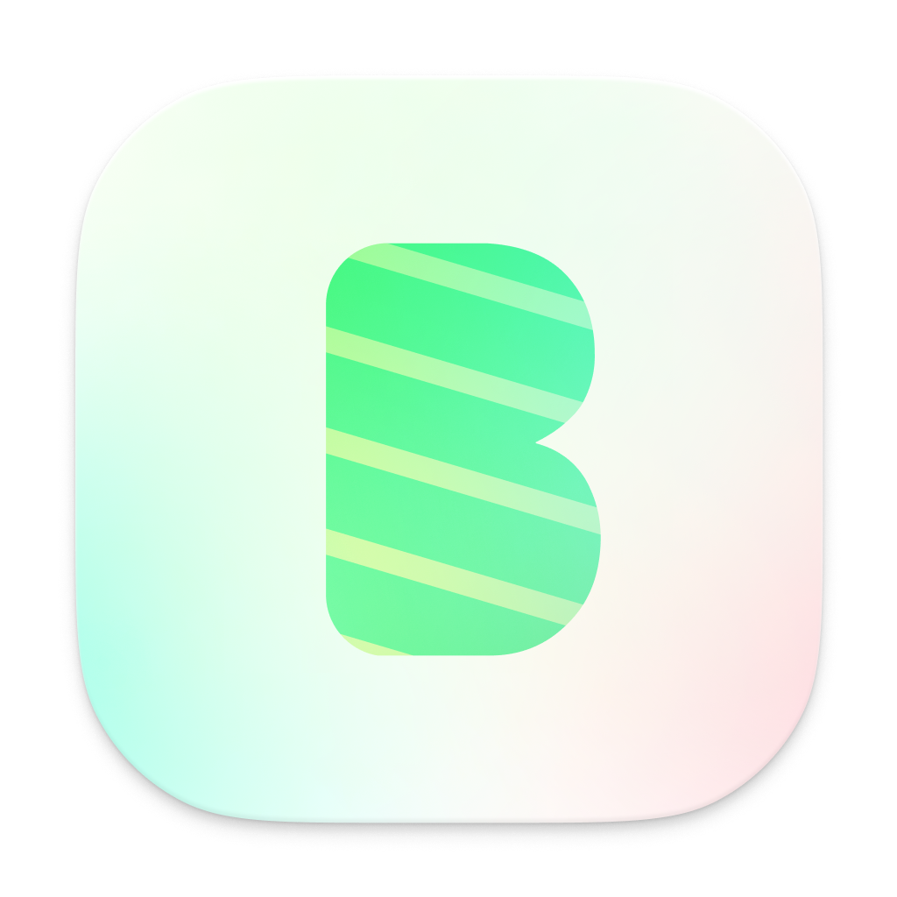

<table border="0" cellspacing="0" cellpadding="0">
  <tr>
    <td width="105" style="padding-right: 0; vertical-align: middle;">
      
    </td>
    <td valign="middle" style="padding-left: 5px;">
      <div style="font-size: 28px; font-weight: bold; margin-top: -5px;"><a href="https://botgem.com">BotGem</a></div>
      <div style="font-size: 18px; margin-top: -2px;">Your AI-powered toolbox for tomorrow</div>
    </td>
  </tr>
</table>

This repository contains the official documentation for [BotGem](https://botgem.com).

## Overview

[BotGem](https://botgem.com) is a versatile application that provides AI-powered tools to enhance productivity and creativity. This documentation site is built with [VitePress](https://vitepress.dev/) and serves as a comprehensive resource for users to learn about [BotGem](https://botgem.com)'s features, integrations, and capabilities.

The official documentation is deployed and accessible at [docs.botgem.com](https://docs.botgem.com).

## Getting Started

### Prerequisites

- [Node.js](https://nodejs.org/) (v18 or higher)
- npm or yarn

### Installation

1. Clone this repository
2. Install dependencies:
   ```bash
   npm install
   ```

### Local Development

To start the development server:

```bash
npm run docs:dev
```

The site will be available at http://localhost:5173

### Build

To build the documentation for production:

```bash
npm run docs:build
```

### Preview Production Build

To preview the production build locally:

```bash
npm run docs:preview
```

## Deployment

The documentation is officially deployed at [docs.botgem.com](https://docs.botgem.com). After building the site with `npm run docs:build`, the generated static files in the `docs/.vitepress/dist` directory can be deployed to your hosting platform of choice.

## Documentation Structure

- **Get Started**: Introduction and quickstart guides
- **Guides**: Detailed documentation on specific features
  - Service Providers
  - Ollama Integration
  - AI-Fusion
- **Partner With Us**: Information for potential partners
- **FAQ**: Frequently asked questions

## Multilingual Support

The documentation is available in:
- English (default)
- Chinese (zh)

## Contributing

Contributions to improve the documentation are welcome. Please feel free to submit a pull request.

## Contact

For more information, visit [BotGem's website](https://botgem.com) or reach out through the [contact page](https://docs.botgem.com/contact).
